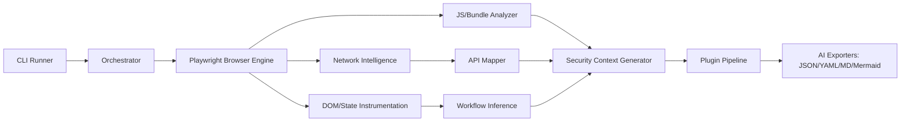

# WebApp Intelligence & Audit Context Generator

## 1) System Design (Production-Grade)
- **Control Plane**: CLI / job runner accepts target URL, scope policy, role profiles, plugin set.
- **Runtime Plane**: Playwright browser cluster with persistent contexts and deterministic action planner.
- **Data Plane**: Event bus normalizes browser/network/runtime events into typed records.
- **Analysis Plane**: API mapper, workflow inference engine, JS reverse engineering, and security rule engine.
- **Export Plane**: AI-ready briefing + dossier outputs in JSON/YAML/Markdown/Mermaid.

## 2) High-Level Architecture Diagram


## 3) Module Coverage
- Intelligent crawler: SPA navigation, hidden route extraction, form walking, modals, pagination, infinite scroll.
- Network layer: HTTP/GraphQL/WebSocket/SSE capture, auth headers/cookies, schema extraction.
- JS RE layer: source map lookup, secret scanning heuristics, framework fingerprinting, sink detection.
- Workflow engine: state machine building, trust boundary labeling, role-diff pathing.
- Security generator: candidate risk scoring for IDOR/auth bypass/CSRF/race conditions.
- AI exporter: deterministic chunking and condensed brief optimized for RAG.

## 4) Data Schemas
Primary schema lives in `src/intel/models/schema.ts` and includes:
- `RouteNode`
- `ApiEndpoint`
- `WorkflowStep`
- `AuthSignal`
- `SecurityFinding`
- `AppContextDossier`

## 5) Implementation Roadmap
1. **Foundation**: schema, orchestrator, event model, deterministic run IDs.
2. **Exploration v1**: breadth-first route discovery + action budget.
3. **Network v1**: endpoint inventory + auth matrix + CORS/CSRF signals.
4. **Workflow v1**: state transition and role-diff discovery.
5. **Security v1**: rule-based likely vulnerability candidates.
6. **Export v1**: JSON/YAML/MD/Mermaid + concise AI briefing.
7. **Plugins**: JWT, GraphQL, CSP, Swagger, cloud asset, websocket analyzer.
8. **Scale**: queue workers + persistent storage + caching and retry controls.

## 6) Concurrency & Storage Model
- **Concurrency**: worker pool per target with route frontier queues and per-origin token-bucket limits.
- **Storage**:
  - SQLite local for single-run portability.
  - Postgres for multi-tenant historical baselining.
  - Optional graph DB (Neo4j) for relationship-heavy visual queries.

## 7) Stealth, Ethics, and Guardrails
- Respect robots/policy toggles and explicit scope constraints.
- Disabled-by-default active exploitation.
- Hard limits: request rate, depth, time, and credential replay budget.
- Redaction: tokens, secrets, personal data masked before export.

## 8) Advanced Features
- Autonomous hypothesis engine (“admin endpoint likely hidden behind feature flag”).
- Interestingness score combining mutating endpoint density + auth complexity + weak boundaries.
- Differential role analysis with multi-account replay.
- Anti-automation awareness and fallback behavior profiles.
- Dynamic route fuzzing for parameterized SPA routers.
- Workflow anomaly detector comparing expected vs observed transitions.

## 9) CLI
```bash
node dist/intel/cli/intel.cli.js https://target.app ./artifacts/intel-target
```

## 10) Future Roadmap
- LLM-in-the-loop adaptive crawling planner.
- Session replay parser integration.
- HAR-only offline intelligence mode.
- Web dashboard with timeline + graph pivot + finding triage.
