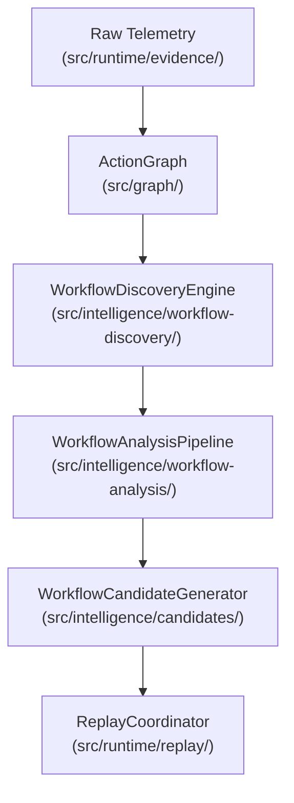

# Canonical Workflow Analysis Doctrine

This directory and its nested sub-packages form the **Canonical Active Subsystem** for business-logic and security gap workflow analysis within the Browser Runtime Intelligence Platform.

## 1. Domain Ownership Manifest

| Namespace | Path | Subsystem Classification | Input Source | Description |
|---|---|---|---|---|
| **Canonical Active** | `src/intelligence/workflow-analysis/` | Active Subsystem | `ActionGraph` | Performs deterministic, capped DFS path extraction, boundary matching, risk scoring, and evidence packaging. |
| **Canonical Active** | `src/intelligence/workflow-discovery/` | Active Subsystem | `ActionGraph` | Drives node classification and semantic boundary mapping from patterns. |
| **Canonical Active** | `src/intelligence/workflow-models/` | Active Subsystem | Contracts | Contains canonical structural interfaces for entities, transitions, and boundaries. |
| **Canonical Active** | `src/intelligence/candidates/` | Active Subsystem | Output Packages | Generates deterministic `InvestigationCandidate` value objects from evidence. |
| **Legacy Compatibility** | `src/intelligence/workflows/` | Compatibility Subsystem | `ActionGraph` | Performs ID masking and graph canonicalization for the active `ConcreteDifferentialEngine`. |
| **Deprecated / Stale** | `src/intelligence/workflow/` | Stale Subsystem | `NormalizedEvent[]` | Legacy event-based workflow chunking/inference. DO NOT USE. |
| **Legacy Forbidden** | `src/intel/` | Deprecated Core | Telemetry | Archival CLI/crawling codebase. Forbidden from imports per `architecture-manifest.json`. |
| **Experimental Annotation** | `src/intelligence/cognition/` | Sidecar Subsystem | Telemetry | Probabilistic AI sidecar annotation layer. |
| **Experimental Annotation** | `src/intelligence/hypotheses/` | Sidecar Subsystem | Telemetry | Probabilistic AI investigation claims layer. |

## 2. The One-Way Dependency Doctrine

To guarantee system stability, all intelligence layers must conform to a strict, unidirectional dependency path. State propagation or mutations flowing in the reverse direction are prohibited.

* **Runtime Isolation**: The core execution engine (`src/runtime/`) has ZERO dependency on `src/intelligence/workflow-analysis/`. Telemetry is emitted passively.
* **Sidecar Non-Mutation**: The intelligence sidecar can read from the `ActionGraph` but is strictly forbidden from mutating the graph, altering runtime configurations, or changing Playwright browser page routing directly.
* **Deterministic Supremacy**: Experimental AI annotations in `cognition/` and `hypotheses/` are secondary. Replay-derived evidence and strict rule classification are the sole authorities for verified security gaps.
